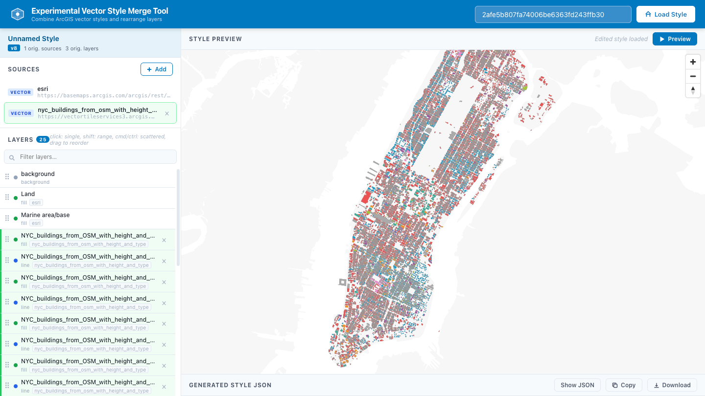

# ArcGIS Vector Style Custom Source

ArcGIS Vector Style Custom Source is an experimental utility for loading ArcGIS vector tile styles, combining sources, inspecting style structure, and rearranging layers outside the official style editor.

- Live: https://hhkaos.github.io/arcgis-developer-tools/arcgis-vector-style-custom-source/
- Source: ./

## Notes

- This tool is a static browser app intended for GitHub Pages deployment.
- Keep `preview.png` in this folder so the root repository README can reference the same screenshot.
