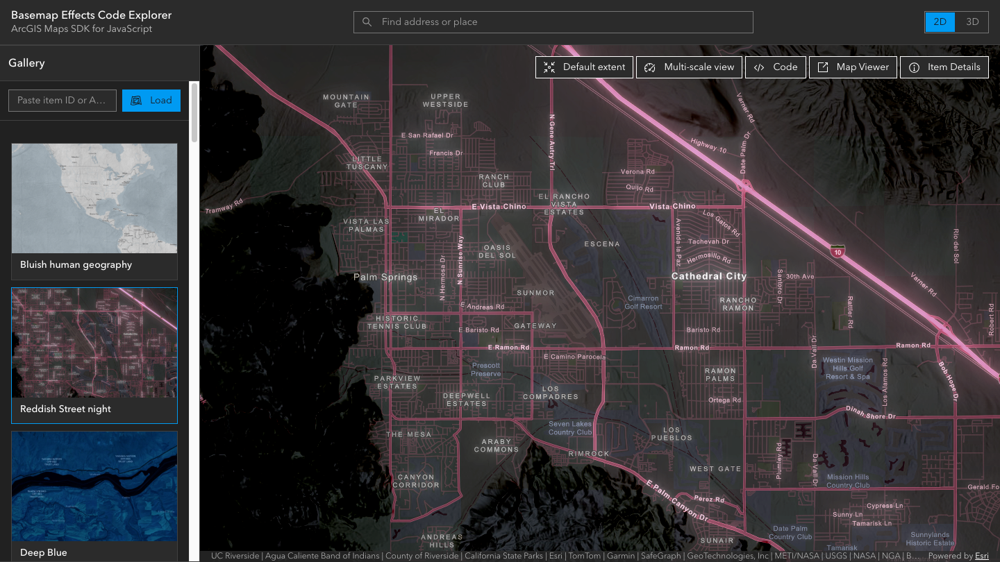

# Basemap Effects Code Explorer



Basemap Effects Code Explorer is an ArcGIS playground for testing basemap visual effects in 2D and 3D, loading maps by item ID, comparing rendering support, and generating code for the active configuration.

- Live: https://hhkaos.github.io/arcgis-developer-tools/basemap-effects-code-explorer/
- Source: ./

## Local development

```bash
npm install
npm run dev
```

## Notes

- Build with `npm run build`.
- Keep `preview.png` in this folder so the root repository README can reference the same screenshot.
