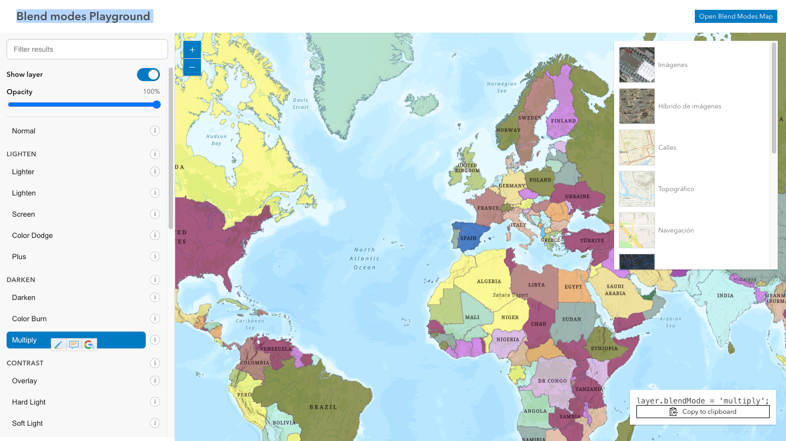

# Blend Modes Explorer

[](https://hhkaos.github.io/arcgis-developer-tools/blend-modes-explorer/)

Blend Modes Explorer is a browser-based playground for understanding ArcGIS layer blend modes, with grouped mode explanations and an interactive map to compare visual outcomes.

- Live: https://hhkaos.github.io/arcgis-developer-tools/blend-modes-explorer/
- Source: ./

## Local development

```bash
npm install
npm run dev
```

## Notes

- Build with `npm run build`.
- Keep `preview.png` in this folder so the root repository README can reference the same screenshot.
