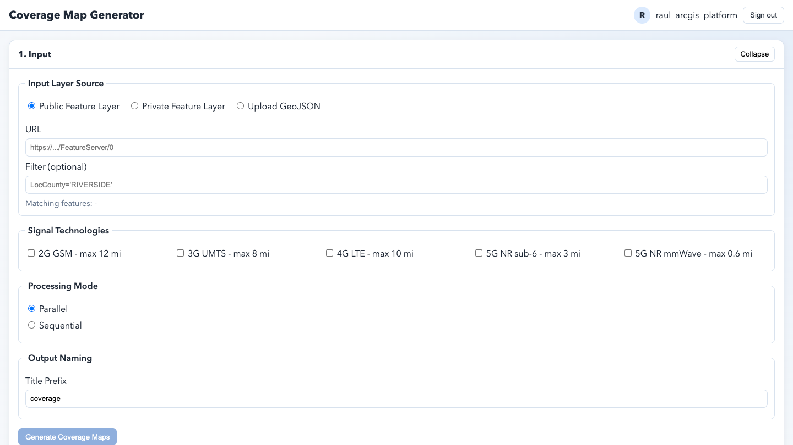

# Coverage Map Generator

Coverage Map Generator is a static ArcGIS utility for generating coverage maps from public layers, private layers, or uploaded GeoJSON, then reviewing, dissolving, and downloading the resulting outputs.

- Live: https://hhkaos.github.io/arcgis-developer-tools/coverage_map_generator/
- Source: ./

## Notes

- This tool is a static browser app intended for GitHub Pages deployment.
- Keep `preview.png` in this folder so the root repository README can reference the same screenshot.
