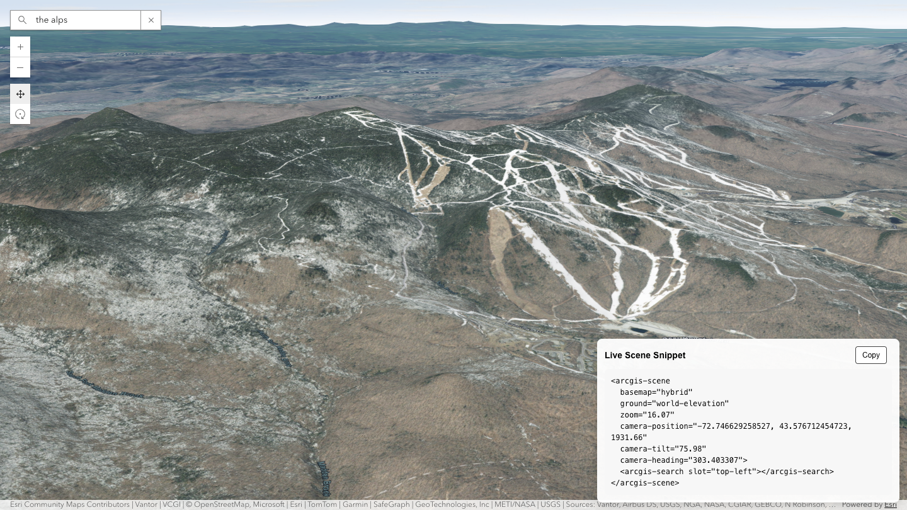

# Get Scene Camera Snippet

Get Scene Camera Snippet is a scene helper that watches the current 3D camera and continuously generates a copyable `<arcgis-scene>` snippet with the live camera position, tilt, and heading.

- Live: https://hhkaos.github.io/arcgis-developer-tools/get-scene-camera-snippet/
- Source: ./

## Notes

- This tool is a static browser app intended for GitHub Pages deployment.
- Keep `preview.png` in this folder so the root repository README can reference the same screenshot.
