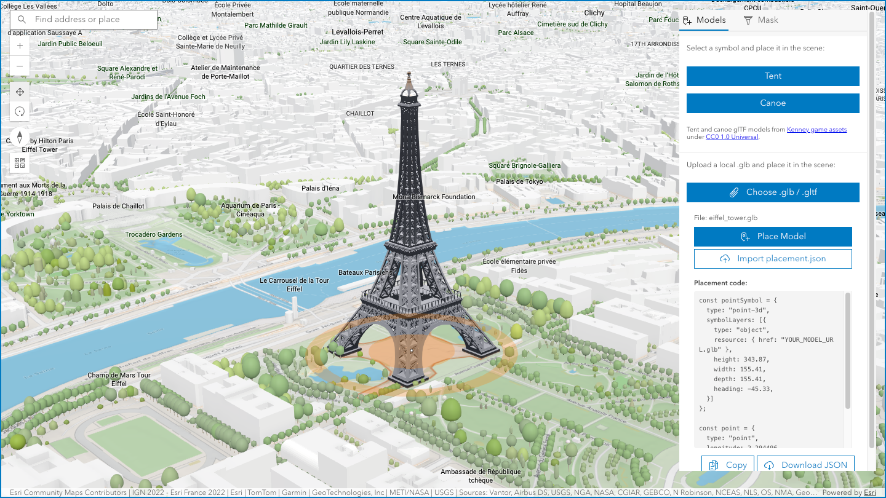

# glTF Placement

glTF Placement is a 3D placement tool for dropping preset or uploaded glTF models into a scene, exporting placement JSON, and creating or applying polygon masks.

- Live: https://hhkaos.github.io/arcgis-developer-tools/gltf-placement/
- Source: ./

## Notes

- This tool is a static browser app intended for GitHub Pages deployment.
- Keep `preview.png` in this folder so the root repository README can reference the same screenshot.
