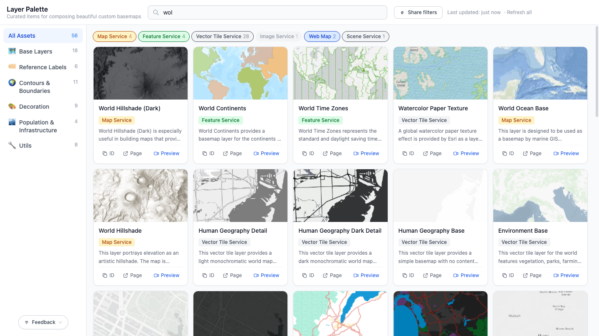

# Layer Palette

[](https://hhkaos.github.io/arcgis-developer-tools/layer-palette/)

Layer Palette is a small ArcGIS developer tool for browsing a curated palette of public ArcGIS layers and item references used to compose custom basemaps. It provides searchable cards, metadata previews, item ID copying, and in-app Map Viewer previews for supported ArcGIS item types.

This project is a static frontend built for GitHub Pages and lives inside the `arcgis-developer-tools` workspace.

## What it does

- Organizes curated assets into categories such as Base Layers, Reference Labels, Contours & Boundaries, Decoration, Population & Infrastructure, and Utils
- Fetches live item metadata from the ArcGIS REST API for public items
- Caches fetched metadata in `localStorage` to reduce repeat requests
- Lets you search across titles, snippets, descriptions, tags, keywords, and item IDs
- Supports direct preview links and embedded Map Viewer previews when applicable
- Handles external reference links for Living Atlas searches, docs, and groups that are not single ArcGIS items

## Tech stack

- Vanilla JavaScript
- Vite
- Tailwind CSS via PostCSS

## Project structure

```text
layer-palette/
├── index.html
├── src/
│   ├── api.js
│   ├── cache.js
│   ├── main.js
│   ├── style.css
│   └── config/
│       └── assets.json
├── package.json
├── vite.config.js
├── tailwind.config.js
└── postcss.config.js
```

## Local development

Install dependencies:

```bash
npm install
```

Start the Vite dev server:

```bash
npm run dev
```

Create a production build:

```bash
npm run build
```

Preview the production build locally:

```bash
npm run preview
```

The production output is generated in `dist/`.

## Configuration and data

The source of truth for the asset catalog is [src/config/assets.json](/Users/ral97612/workspace/arcgis-developer-tools/layer-palette/src/config/assets.json).

### Adding a standard ArcGIS item

Add an item with its ArcGIS item ID and one or more categories:

```json
{
  "id": "97fa1365da1e43eabb90d0364326bc2d",
  "categories": ["base-layers"]
}
```

Runtime metadata such as title, snippet, description, type, tags, and thumbnail is fetched from the ArcGIS REST API.

### Adding an external reference

Use a hardcoded entry when the asset is really a docs page, group, or search URL rather than a single ArcGIS item:

```json
{
  "id": "_external_example",
  "categories": ["utils"],
  "hardcoded": {
    "title": "Example external resource",
    "snippet": "Short description.",
    "thumbnailUrl": "",
    "externalUrl": "https://example.com",
    "type": "External"
  }
}
```

External items are displayed as links and do not support item ID copy or Map Viewer preview.

### Adding a category

Add a category definition in the `categories` array, then reference that category ID from item entries:

```json
{
  "id": "my-category",
  "label": "My Category",
  "icon": "🗂️"
}
```

## How it works

- [src/main.js](/Users/ral97612/workspace/arcgis-developer-tools/layer-palette/src/main.js) handles state, rendering, search, filtering, modal behavior, and preview behavior
- [src/api.js](/Users/ral97612/workspace/arcgis-developer-tools/layer-palette/src/api.js) builds ArcGIS URLs and fetches item metadata
- [src/cache.js](/Users/ral97612/workspace/arcgis-developer-tools/layer-palette/src/cache.js) manages the `localStorage` cache and cache invalidation
- [index.html](/Users/ral97612/workspace/arcgis-developer-tools/layer-palette/index.html) contains the static app shell

## Contributing

Contributions should keep the catalog accurate, the UI behavior predictable, and the app easy to maintain.

1. Create a branch for your change.
2. Install dependencies with `npm install`.
3. Make your update.
4. Run `npm run build` to verify the app still builds cleanly.
5. Review the generated app locally with `npm run preview` when your change affects UI behavior.
6. Open a pull request with a clear description of the change and any asset or behavior impact.

### Contribution guidelines

- Prefer small, focused changes
- Keep asset edits in `src/config/assets.json` unless behavior or presentation also needs to change
- Use only public ArcGIS items that can be fetched without authentication
- For non-item resources, use `_external_...` entries with `hardcoded` metadata
- Preserve existing project style and keep the app framework-free unless there is a strong reason to change that
- If you change behavior, verify it in the browser before submitting

## Notes

- Metadata is fetched from `https://www.arcgis.com/sharing/rest/content/items/{itemId}?f=json`
- Cached metadata is stored in `localStorage` with a 24-hour TTL
- `vite.config.js` uses relative paths so the app can be deployed to GitHub Pages
