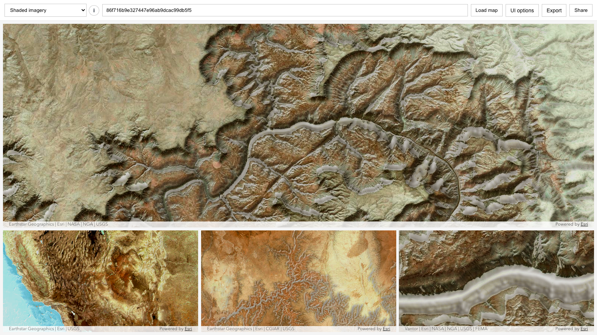

# WebMap Multiview Explorer

WebMap Multiview Explorer loads a WebMap by item ID and shows one main view plus synchronized comparison views at multiple zoom levels.

- Live: https://hhkaos.github.io/arcgis-developer-tools/webmap-multiview-explorer/
- Source: ./

## Notes

- This tool is a static browser app intended for GitHub Pages deployment.
- Keep `preview.png` in this folder so the root repository README can reference the same screenshot.
